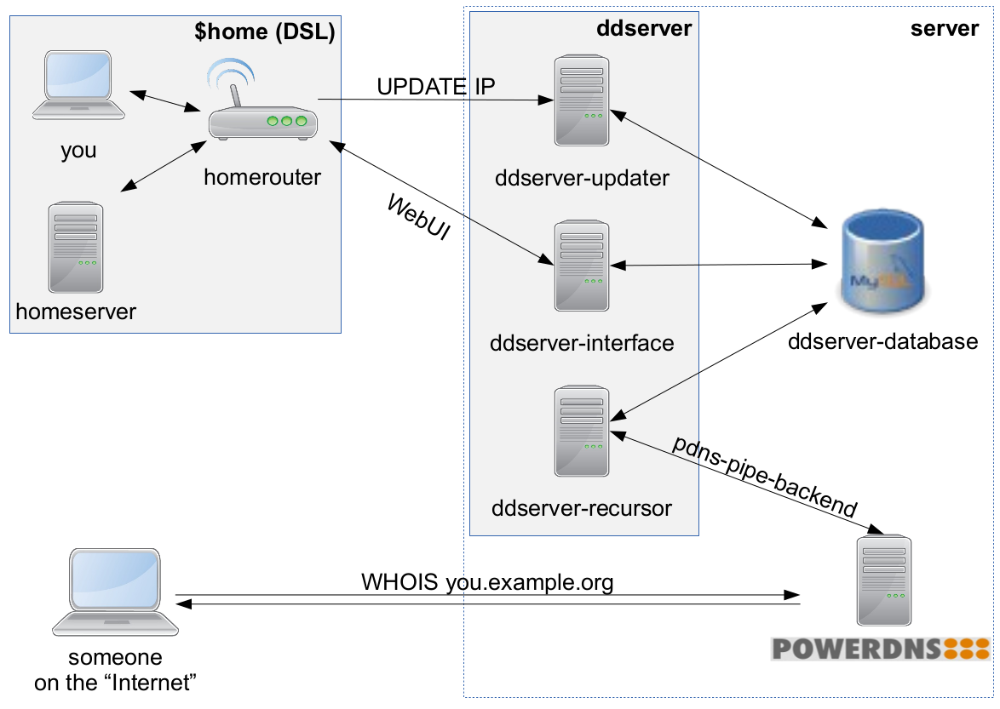

include::globals.adoc[]

[float]
= ddserver: A dynamic DNS management application

ddserver is a server-side application for dynamic DNS management.

It allows one to specify hostnames (subdomains) inside one or more dynamic DNS zones, and to update the IPv4 address of these hostnames using a dynamic update protocol (dyndns2 protocol).
This enables a user to access hosts with dynamic IP addresses by a static domain name, even though the IP address of the host can change.
As updates of the IP address are performed using the dyndns2 update protocol, most DSL home-routers are able to send updates of the IP address.
Alternatively, there is a tool called ddclient, which can be used to send updates from any *NIX-based operating system. 

== Features

ddserver was initially written to fulfill the needs of a small hackerspace.
Since then, it has been improved and expanded by new features, which include

* Nice and intuitive Web-UI
    - Allows for automatic / semi-automatic registration, as well as manual user management
    - reCAPTCHA support for registration, login, and password reset forms
    - Two-factor authentication support using Yubikey
    - Administrators can add and manage zones
    - Users can add and manage their hostnames
* Dynamic IP address updates using the dyndns2 protocol
    - Allows to update multiple hostnames at once
    - Works with most homerouters, ddclient or even wget
    - Manual IP address updates via Web-UI
* Support for multiple dynamic DNS zones
* Individually configurable number of hosts per user
* Strong encryption of all passwords (host and user)
* Static IPv6 address support
* Supports distributed installation
    - Separate packages for Web-UI, updater and DNS-backend
    - Redundancy support

== Application architecture
The ddserver application consists of three individual components, which are included in the ddserver package.

* ddserver-interface
  This componet provides a nice-looking WebUI. It allows administrators to add and manage users and DNS zones, and it allows users to add and manage their hostnames.
* ddserver-updater
  This component implements the dynamic update protocol. It provides an HTTP(S) URL, where update requests can be sent.
* ddserver-recursor
  This is the component, which actually provides answers to DNS requests. It runs as a pipe-backend for the PowerDNS server.

The components may run on one server, or can be distributed on different servers for redundancy and load-balancing.
To ease single-server installations, a wrapper (ddserver-bundle) allows to run the components ddserver-interface and ddserver-updater as a single application.

[TIP]
ddserver provides functions for user and hostname management.
It extends the PowerDNS server using the pipe-backend to answer DNS requests for its zones.
To run a complete dynamic DNS setup, your PowerDNS server must be authoritive for the zone you want to use in ddserver.
If you plan to run the DNS server within the same zone, this includes the setup of DNS Glue Resource Records.

The general architecture of ddserver and the integration with the MySQL database and the PowerDNS server is depicted in the following figure.

[[img-architecture]]
.Lala

//EOF
